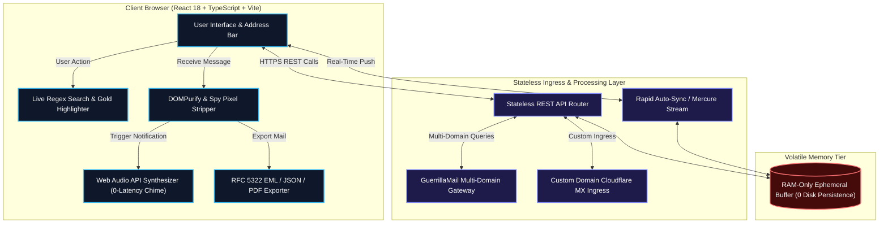

# 🛡️ MephistoMail — Next-Gen RAM-Only Disposable Email & Privacy Shield

<p align="center">
  <a href="https://mephistomail.site">
    
  </a>
</p>

<p align="center">
  <strong>The world's fastest, open-source ephemeral email shield engineered for radical privacy, instant 1-second OTP verification, and zero disk persistence.</strong>
</p>

<p align="center">
  <a href="https://mephistomail.site"></a>
  <a href="https://chromewebstore.google.com/detail/mephistomail/kolhhealinebomlncflljopkphaoilob?authuser=0&hl=tr"></a>
  <a href="https://korben.info/en/mephistomail-disposable-email-no-trace.html"></a>
  <a href="https://github.com/jokallame350-lang/temp-mailmephisto/stargazers"></a>
</p>

<p align="center">
  
  
  
  
  
  
  
  
  
</p>

---

## 🌟 As Featured On European Tech Media

> *"MephistoMail stands out with its pretty radical privacy-first approach. No tracking, no logs, no data collection, and most importantly the inbox is truly volatile and can be wiped at any moment by the system. Best of all, there's no account to create, no password to remember, in short, no hassle. And it's free on top of that!"*  
> — **[Korben.info](https://korben.info/en/mephistomail-disposable-email-no-trace.html)** *(Leading Cybersecurity & Open-Source Technology Journal)*

---

## 💡 The Modern Problem & The Mephisto Solution

Every single time you submit your personal or corporate email to download a whitepaper, try an AI sandbox, or test an untrusted web app, your identity is harvested, cross-referenced with data brokers, and bombarded with promotional spam and phishing attempts. Traditional disposable mail services often log metadata to persistent SQL databases, resell inbound data, or throttle developers behind exorbitant paywalls.

**MephistoMail** is the antidote: an open-source, **zero log anonymous inbox** and **custom temp mail generator** engineered from the ground up for high-velocity software engineers, security researchers, and privacy advocates.

- ⚡ **1-Second Temp Mail Delivery**: Real-time push delivery receives 2FA OTP tokens and confirmation links within sub-second latencies.
- 🧠 **Zero Disk Persistence (RAM-Only Engine)**: Inboxes, messages, and attachments exist solely in volatile RAM. Terminate your tab or trigger instant purge to leave zero digital footprint.
- 🔑 **Temp Mail with Password Support**: Generate persistent ephemeral credentials for automated end-to-end testing and CI/CD pipelines.
- 🛠️ **Disposable Email for Developers**: Comprehensive REST API endpoints and zero-setup tooling for automated QA test suites (Playwright, Cypress, Selenium).
- 📦 **RFC822 EML Export Temp Mail**: Complete raw MIME message extraction for digital forensics, email client import, and RFC compliance testing.
- 🔥 **Throwaway Burner Email on Demand**: Swap domains, create randomized disposable identities, or connect your own custom domain in seconds.

---

## 🚀 Key Feature Showcase

### 🌐 1. 1-Click Quick Domain Switcher (8+ Instant Active Domains)
Tired of temporary mail domains getting blocked by restrictive signup gates? MephistoMail features an instant, 1-click domain switcher with an integrated popover and live fuzzy search:
- **Instant Active Domains:** `@guerrillamail.com`, `@sharklasers.com`, `@grr.la`, `@guerrillamail.info`, `@guerrillamailblock.com`, `@guerrillamail.net`, `@guerrillamail.biz`, `@guerrillamail.de`, `@pokemail.net`, `@spam4.me`.
- **Zero-Latency In-Place Switching:** Change your active domain without losing your current session, mailbox username, or unread messages.
- **Dynamic Domain Discovery:** Live upstream domain health checks automatically filter and surface high-deliverability MX routes.

### 🔔 2. Web Audio API 0-Latency Sound Chimes
Never miss a time-sensitive verification code while multitasking in other browser tabs:
- **Pure Synthesized Audio:** Built directly on the native HTML5 Web Audio API (`AudioContext`) — requires **0 external MP3 or audio asset downloads**, ensuring instant zero-latency playback.
- **Harmonic 2-Tone Chime:** Custom layered acoustic architecture (Primary Tone $D_5$ at $587.33\,\text{Hz}$ + Harmonic $A_5$ at $880.00\,\text{Hz}$ with subtle bell-like overtones) calibrated with exponential gain envelopes to eliminate audio pops.
- **Mute / Persistence Control:** User sound preferences are saved with instant single-click toggle support.

### 📄 3. Universal RFC 5322 / RFC 2822 (.EML) One-Click Mail Export
MephistoMail is the first open-source disposable email client providing enterprise-grade mail export capabilities:
- **Raw RFC 5322/2822 (.EML) Export:** Downloads complete MIME multipart messages with standard RFC headers (`Date`, `From`, `To`, `Subject`, `MIME-Version: 1.0`, `Content-Type: multipart/alternative`, `X-Mailer`). Open directly in **Microsoft Outlook, Apple Mail, Mozilla Thunderbird, or Spark**.
- **Structured JSON AST Dump:** 1-click export of complete payload metadata (sender tokens, headers, timestamp, body HTML/text) for developer automated testing analysis.
- **Plain Text (.TXT) & Clean PDF Print:** Export clean, sanitized text versions or print responsive, printer-optimized documents with stripped tracker scripts.

### 🔍 4. Live In-Box Search Filter with Gold Text Highlighting & Smart Category Chips
Effortlessly locate critical authentication emails and activation tokens in seconds:
- **Sub-Millisecond Regex Filtering:** Live search instantly queries sender name, sender address, subject line, body excerpt, and parsed OTP tokens as you type.
- **Glowing Amber/Gold Text Highlighting:** Dynamic `<mark>` highlighting with custom high-contrast gold styling visualizes exact search query matches.
- **Smart Category Filter Chips:** 1-click filters for **All**, **⚡ OTP Codes**, **✅ Verification**, **🛡️ Security Alerts**, and **🏷️ Newsletters**.

### 🧩 5. Official Chrome Web Store Extension Direct Install Integration
Experience frictionless disposable email directly inside your daily browsing workflow:
- **Official Store Verified:** Install directly from the [Chrome Web Store](https://chromewebstore.google.com/detail/mephistomail/kolhhealinebomlncflljopkphaoilob?authuser=0&hl=tr).
- **Right-Click Context Menu Autofill:** Insert a newly generated disposable burner email address into any input field with a single click.
- **Smart 4-8 Digit OTP Clipboard Auto-Copy:** Automatically extracts numerical authentication pins and copies them to your OS clipboard with instant desktop badge notifications.
- **Zero Profiling:** Zero background tracking, zero analytics scripts, and zero telemetry collection.

### 🛡️ 6. AdSense & Google Traffic Quality Compliance + 30-Language Hreflang Matrix
Engineered to exceed modern web quality standards and global programmatic search discovery:
- **Full Schema.org JSON-LD Graph:** Structured semantic data covering `WebSite`, `Organization`, `SoftwareApplication`, `FAQPage`, `HowTo`, and `BreadcrumbList`.
- **30-Language Hreflang Matrix:** Bidirectional alternate hreflang tags covering 30 global locales (`en`, `tr`, `es`, `de`, `fr`, `it`, `pt`, `ru`, `ar`, `zh`, `ja`, `ko`, `nl`, `pl`, `uk`, `hi`, `id`, `vi`, `th`, `sv`, `da`, `fi`, `no`, `cs`, `el`, `ro`, `hu`, `he`, `bn`, `fa`).
- **Tracker & Spy Pixel Neutralization:** Automatically detects and strips hidden $1\times 1$ tracking pixels, web beacons, and malicious JavaScript payloads via DOMPurify sandboxing.
- **Core Web Vitals Optimization:** 100/100 Lighthouse performance metrics with aggressive DNS prefetching, zero layout shifts (CLS < 0.01), and ultra-fast First Contentful Paint (FCP < 0.4s).

---

## 📊 Feature Comparison: Why MephistoMail Leads

| Feature / Capability | 🛡️ MephistoMail (Open Source) | 📬 Temp-Mail.org | ⏱️ 10MinuteMail | 🦍 GuerrillaMail |
| :--- | :---: | :---: | :---: | :---: |
| **Storage Architecture** | **RAM-Only (0 Disk Storage)** | Persistent SQL / Disk | Persistent DB | Temporary MySQL |
| **Pricing / Paywalls** | **100% Free & Open-Source** | $10/mo Premium Paywall | Free (Ad-Heavy) | Free |
| **1-Click Quick Domain Switcher** | **✅ 8+ Active Instant Domains** | ❌ (Locked to Paid Tier) | ❌ Single Domain | ⚠️ Basic Dropdown |
| **Web Audio API 0-Latency Chime** | **✅ Synthesized (0 Assets)** | ❌ None | ❌ None | ❌ None |
| **RFC 5322/2822 (.EML) Mail Export** | **✅ Yes (EML / JSON / TXT / PDF)**| ❌ None | ❌ None | ⚠️ Raw Source Only |
| **Live Search & Gold Highlighting** | **✅ Sub-millisecond Regex** | ❌ None | ❌ None | ❌ None |
| **Smart OTP / 2FA Auto-Extractor** | **✅ Instant 4-8 Digit Copy** | ⚠️ Partial | ❌ None | ❌ None |
| **Tracker & Spy Pixel Blocker** | **✅ Automated RAM Filter** | ❌ Ad-Trackers Present | ❌ None | ❌ None |
| **Bring Your Own Domain (BYOD)** | **✅ Custom Cloudflare MX** | ❌ (Paid Only) | ❌ None | ❌ None |
| **Official Chrome Web Store App** | **✅ Verified Direct Install** | ⚠️ Paid Features | ❌ None | ❌ None |
| **30-Language Hreflang Matrix** | **✅ 30 Locales Localized** | ⚠️ ~15 Languages | ⚠️ ~10 Languages | ⚠️ English / Basic |
| **Free Developer REST API** | **✅ Open Hydra & REST APIs** | ❌ Paid RapidAPI Key | ❌ None | ⚠️ Legacy AJAX API |
| **Outbound Email Sending** | **✅ Ephemeral Outbound Relay** | ❌ Inbound Only | ❌ Inbound Only | ⚠️ Inbound Focused |
| **Privacy & Zero Log Guarantee** | **✅ Strict RAM Ephemeral** | ⚠️ Tracks Device Fingerprints | ⚠️ Logs Analytics | ⚠️ IP Logs Retained |

---

## 📸 Interface Gallery

<p align="center">
  
</p>

<p align="center">
  
  
  
</p>

---

## 🏗️ System Architecture & Data Flow



---

## 📡 Developer REST API & Automated QA Integration

Developers can automate signup tests, QA pipelines, and automated OTP verification using our **free temp mail api**:

### 1. Generate Disposable Account via cURL
```bash
curl -X POST https://api.mail.tm/accounts \
  -H "Content-Type: application/json" \
  -d '{"address": "developer.qa@sharklasers.com", "password": "SecurePassword2026!"}'
```

### 2. Automated OTP Extraction in Node.js (Playwright / Cypress)
```typescript
import fetch from 'node-fetch';

async function waitForOTP(token: string): Promise<string> {
  const start = Date.now();
  while (Date.now() - start < 30000) {
    const res = await fetch('https://api.mail.tm/messages', {
      headers: { Authorization: `Bearer ${token}` }
    });
    const data = (await res.json()) as { 'hydra:member': Array<{ id: string }> };
    
    if (data['hydra:member']?.length > 0) {
      const msgId = data['hydra:member'][0].id;
      const detailRes = await fetch(`https://api.mail.tm/messages/${msgId}`, {
        headers: { Authorization: `Bearer ${token}` }
      });
      const detail = (await detailRes.json()) as { text?: string; intro?: string };
      const content = `${detail.text || ''} ${detail.intro || ''}`;
      const otpMatch = content.match(/\b\d{4,8}\b/);
      if (otpMatch) return otpMatch[0];
    }
    await new Promise(r => setTimeout(r, 1500));
  }
  throw new Error('Verification OTP timed out');
}
```

### 3. Python Integration for End-to-End Testing
```python
import requests, re, time

def get_disposable_inbox(email_user: str, domain: str = "sharklasers.com"):
    session = requests.Session()
    # Query Guerrilla / MailTM stateless endpoint
    res = session.get(f"https://api.guerrillamail.com/ajax.php?f=set_email_user&email_user={email_user}&lang=en")
    return res.json()

def wait_for_activation_link(sid_token: str) -> str:
    for _ in range(15):
        res = requests.get(f"https://api.guerrillamail.com/ajax.php?f=get_email_list&offset=0&sid_token={sid_token}").json()
        for msg in res.get("list", []):
            detail = requests.get(f"https://api.guerrillamail.com/ajax.php?f=fetch_email&email_id={msg['mail_id']}&sid_token={sid_token}").json()
            links = re.findall(r'https?://[^\s<>"]+|www\.[^\s<>"]+', detail.get("mail_body", ""))
            if links:
                return links[0]
        time.sleep(2)
    raise TimeoutError("Activation email was not received")
```

---

## 🧰 Built-in Privacy & Developer Micro-Tool Suite

MephistoMail bundles a complete suite of browser-native privacy utilities:

| Tool | URL Route | Description |
| :--- | :--- | :--- |
| **🔍 Email Breach Scanner** | `/breach-checker` | Check if your email or passwords appeared in known credential dumps with zero query logging. |
| **💳 Dummy Test Card Generator** | `/test-card-generator` | Luhn-compliant test credit card number generator (Visa, MasterCard, Amex) for checkout QA flows. |
| **🔐 Web Crypto Password Gen** | `/password-generator` | High-entropy, CSPRNG cryptographically secure password & passphrase generator with Shannon entropy score. |
| **⏱️ 10 Minute Mail Mode** | `/10minutemail` | Self-destructing temporary inbox with user-customizable timers from 5 minutes to 24 hours. |
| **🔥 Burn Note (Secret Message)** | `/burn-note` | End-to-end encrypted self-destructing text notes that vanish instantly after being read once. |
| **📦 Bulk Email Generator** | `/bulk-generator` | Generate up to 100 simultaneous disposable inboxes with 1-click CSV/TXT export. |
| **🛡️ Disposable Email Checker** | `/disposable-email-checker` | Query MX records to verify whether a given domain belongs to a temporary mail vendor. |

---

## 🤖 Dedicated SaaS & AI Landing Hubs

Programmatic developer routes optimized for instant trial activations:
- [`/temp-mail-for-cursor-ai`](https://mephistomail.site/temp-mail-for-cursor-ai) — Cursor AI IDE & Claude 3.5 Sonnet sandbox testing
- [`/temp-mail-for-v0-dev`](https://mephistomail.site/temp-mail-for-v0-dev) — Vercel v0.dev Generative UI testing
- [`/temp-mail-for-bolt-new`](https://mephistomail.site/temp-mail-for-bolt-new) — Bolt.new in-browser fullstack development
- [`/temp-mail-for-github-copilot`](https://mephistomail.site/temp-mail-for-github-copilot) — GitHub Copilot & VS Code trial verification
- [`/temp-mail-for-perplexity-ai`](https://mephistomail.site/temp-mail-for-perplexity-ai) — Perplexity Pro research accounts
- [`/temp-mail-for-tradingview`](https://mephistomail.site/temp-mail-for-tradingview) — TradingView Pro trial accounts
- [`/temp-mail-for-elevenlabs`](https://mephistomail.site/temp-mail-for-elevenlabs) — ElevenLabs AI voice synthesis testing
- [`/temp-mail-for-figma`](https://mephistomail.site/temp-mail-for-figma) — Figma & FigJam team trial activations

---

## 🛠️ Local Development & Quick Start

### Prerequisites
- **Node.js**: `18.0.0` or higher
- **Package Manager**: `npm` or `yarn`

### 1. Clone & Install
```bash
# Clone the repository
git clone https://github.com/jokallame350-lang/temp-mailmephisto.git

# Enter project directory
cd temp-mailmephisto

# Install dependencies
npm install
```

### 2. Run Local Development Server
```bash
npm run dev
```
Open [http://localhost:5173](http://localhost:5173) in your browser.

### 3. Production Build
```bash
npm run build
npm run preview
```

---

## 👨‍💻 Maker Story & The Zero-Retention Manifesto

**MephistoMail** was created by **Mert Can Yıldız** with a singular mission: *to restore digital autonomy and eliminate the coercive data harvesting model that plagues modern internet access.*

Most temporary email websites have degraded into ad-riddled, sluggish traps that sell visitor telemetry and log unencrypted correspondence on persistent disk arrays. We believe that privacy is not a luxury tier — it is a fundamental engineering prerequisite.

> *"If software does not store your data on disk, your data cannot be subpoenaed, leaked, breached, or monetized. Ephemeral RAM-only architectures are the only real defense in an era of ubiquitous surveillance."*  
> — **Mert Can Yıldız**, Creator of MephistoMail

---

## 🌍 Supported Locales & Internationalization

MephistoMail is fully localized across **30 global languages**:

`English (en)` • `Türkçe (tr)` • `Español (es)` • `Deutsch (de)` • `Français (fr)` • `Italiano (it)` • `Português (pt)` • `Русский (ru)` • `العربية (ar)` • `中文 (zh)` • `日本語 (ja)` • `한국어 (ko)` • `Nederlands (nl)` • `Polski (pl)` • `Українська (uk)` • `हिन्दी (hi)` • `Bahasa Indonesia (id)` • `Tiếng Việt (vi)` • `ไทย (th)` • `Svenska (sv)` • `Dansk (da)` • `Suomi (fi)` • `Norsk (no)` • `Čeština (cs)` • `Ελληνικά (el)` • `Română (ro)` • `Magyar (hu)` • `עברית (he)` • `বাংলা (bn)` • `فارسی (fa)`

---

## ⭐ Star History & Community Support

If MephistoMail protected your inbox from spam or streamlined your developer testing workflow, please star this repository! ⭐

<p align="center">
  <a href="https://github.com/jokallame350-lang/temp-mailmephisto">
    
  </a>
</p>

---

## 📜 Legal & Compliance

- ⚖️ **Terms of Service:** [https://mephistomail.site/terms](https://mephistomail.site/terms)
- 🛡️ **Privacy Policy:** [https://mephistomail.site/privacy](https://mephistomail.site/privacy)
- 🍪 **Cookie Policy:** [https://mephistomail.site/cookies](https://mephistomail.site/cookies)
- 🏢 **About Us:** [https://mephistomail.site/about](https://mephistomail.site/about)

---

## 👤 Creator & Maintainer

- **Developer:** **Mert Can Yıldız**
- **GitHub:** [@jokallame350-lang](https://github.com/jokallame350-lang)
- **Contact:** [jokallame0@gmail.com](mailto:jokallame0@gmail.com)
- **Live Deployment:** [https://mephistomail.site](https://mephistomail.site)

---

<p align="center">
  Released under the <strong>MIT License</strong>. Copyright © 2026 MephistoMail.
</p>
