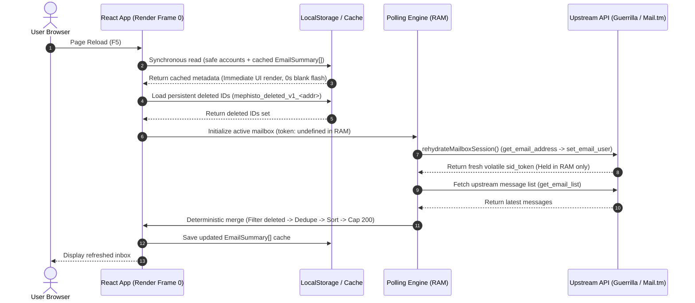
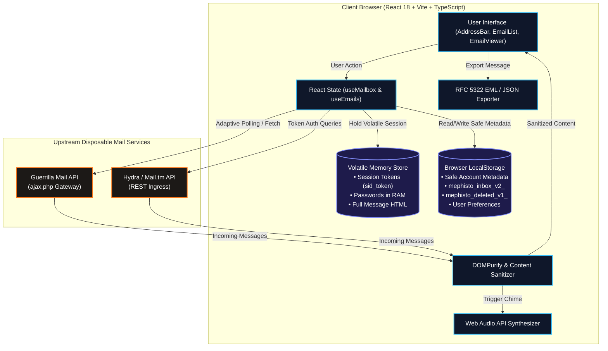

# 🛡️ MephistoMail — Disposable Email & Privacy Client

<p align="center">
  <a href="https://mephistomail.site">
    
  </a>
</p>

<p align="center">
  <strong>An open-source, privacy-focused disposable email frontend client featuring multi-mailbox management, session rehydration, automatic OTP extraction, RFC 5322 EML export, and defense-in-depth content sanitization.</strong>
</p>

<p align="center">
  <a href="https://mephistomail.site"></a>
  <a href="https://chromewebstore.google.com/detail/mephistomail/kolhhealinebomlncflljopkphaoilob?authuser=0&hl=tr"></a>
  <a href="https://korben.info/en/mephistomail-disposable-email-no-trace.html"></a>
  <a href="https://github.com/mephisto-mert/temp-mailmephisto/stargazers"></a>
</p>

<p align="center">
  
  
  
  
  
  
  
  
  
  
</p>

---

## 🌟 Featured In European Tech Media

> *"MephistoMail stands out with its pretty radical privacy-first approach. No tracking, no logs, no data collection, and most importantly the inbox is truly volatile and can be wiped at any moment by the system. Best of all, there's no account to create, no password to remember, in short, no hassle. And it's free on top of that!"*  
> — **[Korben.info](https://korben.info/en/mephistomail-disposable-email-no-trace.html)** *(Cybersecurity & Open-Source Journal)*

---

## 💡 What is MephistoMail?

**MephistoMail** is a modern, client-side disposable email application designed for software developers, QA automation engineers, and privacy-conscious users. It connects to established upstream disposable email providers (such as Guerrilla Mail and Hydra / Mail.tm) to provide instant inbound email receipt, automated OTP verification code parsing, and secure message inspection without requiring user accounts or registration.

### Core Highlights:
* 📥 **Inbound Email Client:** Direct integration with upstream disposable mail APIs for real-time inbox polling and message inspection.
* ⚡ **Automatic OTP Extraction:** Extracts 4-to-8 digit verification pins from subject lines and message bodies with 1-click clipboard copy.
* 🌐 **Dynamic Domain Switcher:** 1-click domain switching across discovered active upstream domains (`@guerrillamail.com`, `@sharklasers.com`, `@grr.la`, etc.).
* 📄 **Universal Mail Export:** Export complete messages as RFC 5322 `.EML`, structured JSON, plain text `.TXT`, or sanitized print view.
* 🔔 **Synthesized Audio Chimes:** Pure Web Audio API acoustic notifications on incoming emails (zero external audio file downloads).
* 🛡️ **Defense-in-Depth Sanitization:** DOMPurify sanitization, dangerous URL protocol blocking, private IP address defense, and executable attachment neutralization.
* 🔄 **Reload & Session Recovery:** Rehydrates upstream sessions on page reload (F5) while preserving local inbox summaries and persistent deletion sets.

---

## 🔒 Technical Privacy & Storage Architecture

MephistoMail follows a strict tiered storage model to ensure sensitive credentials never touch persistent browser storage while safe metadata provides a seamless user experience across page reloads:

```
┌──────────────────────────────────────────────────────────────────────────┐
│                           STORAGE ARCHITECTURE                           │
├────────────────────────────────┬─────────────────────────────────────────┤
│ Tier                           │ Data Stored & Scope                     │
├────────────────────────────────┼─────────────────────────────────────────┤
│ 1. Volatile Runtime Memory     │ • Upstream session tokens (sid_token)   │
│    (JavaScript Heap / RAM)     │ • Mailbox passwords (credentialStore)   │
│                                │ • Full raw HTML email bodies / details  │
│                                │ • In-flight AbortControllers & timers   │
├────────────────────────────────┼─────────────────────────────────────────┤
│ 2. Local Safe Storage          │ • Safe account metadata (id, address,   │
│    (localStorage /             │   createdAt, label, autoDeleteMinutes)  │
│     sessionStorage)            │ • Inbox summaries (EmailSummary[]: id,  │
│                                │   from, subject, intro, seen, date)     │
│                                │ • Deleted message IDs (to prevent       │
│                                │   resurrection across polls / reloads)  │
│                                │ • User preferences (theme, lang, sound) │
├────────────────────────────────┼─────────────────────────────────────────┤
│ 3. Never Persisted             │ ❌ Upstream authentication tokens       │
│    (Explicitly Excluded)       │ ❌ Passwords or auth secret headers     │
│                                │ ❌ Tracking cookies or analytics logs   │
└────────────────────────────────┴─────────────────────────────────────────┘
```

> [!IMPORTANT]
> **Third-Party Provider Dependency:** MephistoMail is a frontend client that communicates with upstream disposable email providers (e.g. Guerrilla Mail, Mail.tm). The lifetime of upstream mailboxes (typically 60 minutes on Guerrilla Mail) and server-side retention policies are governed by those respective services. MephistoMail itself does not operate a persistent backend database.

---

## 🗂️ Session & Multi-Mailbox Architecture

MephistoMail supports managing up to **100 concurrent mailboxes** in a single browser tab with rigorous state and cache isolation:

* **Canonical Full Email Address Cache Isolation:** Every mailbox's local cache is keyed strictly by its normalized full address:
  ```
  mephisto_inbox_v2_alpha.test@guerrillamail.com
  mephisto_inbox_v2_alpha.test@sharklasers.com
  ```
  Accounts sharing the same username on different domains maintain completely isolated caches with zero data cross-contamination.
* **Persistent Deleted Message Tracking:** When a message is deleted, its ID is written to a dedicated per-mailbox set (`mephisto_deleted_v1_<normalized-address>`). On page reload (F5) or subsequent upstream polls, deleted IDs are filtered out, preventing "zombie" emails from reappearing.
* **Race-Condition Protection:** All asynchronous requests carry unique request IDs (`fetchRequestIdRef`, `activeAccountIdRef`). If a user rapidly switches between accounts (A $\leftrightarrow$ B), late-arriving responses from previous accounts are discarded.
* **Secondary Account Background Sync:** Open secondary mailboxes are periodically polled in the background to update unread badge counters without disturbing the active account's view.

---

## 🔄 Reload (F5) & Session Recovery Flow

When a user refreshes the page or reopens a saved mailbox URL (`?mailbox=user@domain.com`):



---

## 🛡️ Security & Content Defense-in-Depth

MephistoMail enforces rigorous client-side security policies to protect users when viewing untrusted emails:

* **HTML Sanitization via DOMPurify:** Strips malicious `<script>`, `<object>`, `<embed>`, `<iframe>`, `<form>`, inline event handlers (`onload`, `onerror`), and tracking pixels.
* **Dangerous Protocol Filtering:** Action link extractors and viewers explicitly block hazardous URI schemes (`javascript:`, `file:`, `data:`, `blob:`, `content:`, `chrome:`).
* **Private IP Address Defense:** Link analyzers reject private, loopback, and local network ranges (`127.0.0.1`, `localhost`, `10.0.0.0/8`, `172.16.0.0/12`, `192.168.0.0/16`, `0.0.0.0/8`), including obfuscated hex and decimal integer representations (`http://2130706433`).
* **Attachment Security:** Blocks dangerous executable extensions (`.exe`, `.dll`, `.bat`, `.cmd`, `.sh`, `.vbs`, `.msi`, `.scr`, `.jar`, `.ps1`), sanitizes directory traversal characters (`../`, `..\`), enforces a 25 MB size limit, and verifies MIME type consistency.
* **Service Worker Cache Isolation:** `public/sw.js` strictly bypasses caching for any cross-origin API requests, ensuring private email payloads are never written to Service Worker cache storage.

---

## 🚀 Key Feature Showcase

### 🌐 1. Dynamic Domain Switcher
* **Live Discovery:** Upstream domains are dynamically fetched and refreshed via `fetchDomains()`.
* **Instant Switching:** Change domain extensions on demand (`@guerrillamail.com`, `@sharklasers.com`, `@grr.la`, `@guerrillamailblock.com`, `@guerrillamail.de`, etc.) without losing active state.

### 🔔 2. Web Audio API Acoustic Chimes
* **Zero External Assets:** Built on native HTML5 `AudioContext` — synthesizes a layered two-tone harmonic chime ($D_5$ at $587.33\,\text{Hz}$ and $A_5$ at $880.00\,\text{Hz}$) with exponential decay envelopes.
* **Instant Toggle:** User sound preferences are saved locally with 1-click mute/unmute control.

### 📄 3. Universal Mail Exporter
* **RFC 5322 / RFC 2822 (`.EML`):** Exports full MIME formatted messages with standard headers (`Date`, `From`, `To`, `Subject`, `MIME-Version: 1.0`, `Content-Type: text/html; charset=UTF-8`). Compatible with Outlook, Apple Mail, Thunderbird, and forensic tools.
* **JSON AST Export:** Structured JSON dump of headers, sender metadata, timestamps, and body content for automated QA analysis.
* **Plain Text (`.TXT`) & Print:** Clean text exports and print-optimized views with stripped trackers.

### 🔍 4. In-Box Search & Category Highlighting
* **Live Search:** Instant client-side search across sender names, email addresses, subjects, intros, and OTP codes.
* **Visual Match Highlighting:** Dynamic `<mark>` highlighting with high-contrast amber styling.
* **Smart Filter Chips:** 1-click filtering by category: All, ⚡ OTP Codes, ✅ Verification, 🛡️ Security Alerts, and 🏷️ Newsletters.

### 🧩 5. Chrome Extension (Manifest V3)
* **Manifest V3 Compliant:** Full extension implementation located in the `extension/` directory.
* **Context Menu Autofill:** Right-click on any input field to generate and insert a disposable address.
* **Clipboard OTP Sync:** Automatically detects incoming verification codes and copies them to the clipboard.
* **Web Store:** Published on the [Chrome Web Store](https://chromewebstore.google.com/detail/mephistomail/kolhhealinebomlncflljopkphaoilob?authuser=0&hl=tr).

---

## 📸 Interface Gallery

<p align="center">
  
</p>

<p align="center">
  
  
  
</p>

---

## 🏗️ Architecture & Data Flow



---

## 🧰 Built-in Privacy & Developer Utilities

MephistoMail includes a complete suite of browser-native client-side privacy tools:

| Utility | Route | Description |
| :--- | :--- | :--- |
| **🔍 Email Breach Scanner** | `/breach-checker` | Check if an email address appears in publicly known breach databases. |
| **💳 Test Card Generator** | `/test-card-generator` | Luhn-compliant test credit card number generator for QA checkout flows. |
| **🔐 Password Generator** | `/password-generator` | Cryptographically secure (CSPRNG) password & passphrase generator with Shannon entropy calculation. |
| **⏱️ 10 Minute Mail Mode** | `/10minutemail` | Ephemeral temporary inbox mode with customizable auto-expiration countdowns. |
| **🔥 Burn Note** | `/burn-note` | Client-side encrypted self-destructing text notes stored via URL hash fragments. |
| **📦 Bulk Mailbox Generator** | `/bulk-generator` | Generate multiple disposable addresses simultaneously with CSV/TXT export. |
| **🛡️ Disposable Checker** | `/disposable-email-checker` | Inspect domain MX records to identify known disposable email providers. |

---

## 📡 Developer QA & Automation Examples

Developers can leverage upstream disposable email APIs within test automation frameworks (Playwright, Cypress, Selenium):

### Node.js / Playwright OTP Extraction Example
```typescript
import { test, expect } from '@playwright/test';

test('verify signup confirmation with disposable inbox', async ({ page, request }) => {
  const username = `qa.test.${Date.now()}`;
  
  // 1. Establish session with Guerrilla Mail API
  const initRes = await request.get(`https://api.guerrillamail.com/ajax.php?f=set_email_user&email_user=${username}&lang=en`);
  const session = await initRes.json();
  const sid = session.sid_token;
  const emailAddress = `${username}@sharklasers.com`;

  // 2. Submit email to your application under test
  await page.goto('https://example.com/signup');
  await page.fill('input[type="email"]', emailAddress);
  await page.click('button[type="submit"]');

  // 3. Poll for incoming verification message
  let otpCode = '';
  for (let i = 0; i < 15; i++) {
    await page.waitForTimeout(2000);
    const listRes = await request.get(`https://api.guerrillamail.com/ajax.php?f=get_email_list&offset=0&sid_token=${sid}`);
    const listData = await listRes.json();
    
    if (listData.list && listData.list.length > 0) {
      const mailId = listData.list[0].mail_id;
      const fetchRes = await request.get(`https://api.guerrillamail.com/ajax.php?f=fetch_email&email_id=${mailId}&sid_token=${sid}`);
      const mailDetail = await fetchRes.json();
      
      const match = (mailDetail.mail_body || mailDetail.mail_excerpt || '').match(/\b\d{4,8}\b/);
      if (match) {
        otpCode = match[0];
        break;
      }
    }
  }

  expect(otpCode).not.toBe('');
  await page.fill('input[name="otp"]', otpCode);
  await page.click('button[name="verify"]');
});
```

---

## 🌍 Internationalization (i18n) & Locales

MephistoMail features **9 fully translated UI languages** with 100% key parity across all 285 localization keys, including full Right-to-Left (RTL) layout support:

| Code | Language | Direction | Translation Coverage |
| :---: | :--- | :---: | :---: |
| `en` | English | LTR | **100% (285 / 285 keys)** |
| `tr` | Türkçe (Turkish) | LTR | **100% (285 / 285 keys)** |
| `de` | Deutsch (German) | LTR | **100% (285 / 285 keys)** |
| `es` | Español (Spanish) | LTR | **100% (285 / 285 keys)** |
| `fr` | Français (French) | LTR | **100% (285 / 285 keys)** |
| `it` | Italiano (Italian) | LTR | **100% (285 / 285 keys)** |
| `pt` | Português (Portuguese) | LTR | **100% (285 / 285 keys)** |
| `ru` | Русский (Russian) | LTR | **100% (285 / 285 keys)** |
| `ar` | العربية (Arabic) | **RTL** | **100% (285 / 285 keys)** |

> [!NOTE]
> `index.html` includes alternate `hreflang` metadata targeting 30 regional search discovery locales, while the interactive application UI is currently fully translated into the 9 primary languages listed above.

---

## 🛠️ Local Development & Quick Start

### Prerequisites
* **Node.js:** `v18.0.0` or higher (tested on Node.js v20 and v24)
* **npm:** `v9.0.0` or higher

### 1. Installation
```bash
# Clone repository
git clone https://github.com/mephisto-mert/temp-mailmephisto.git
cd temp-mailmephisto

# Clean install dependencies
npm ci
```

### 2. Development Server
```bash
npm run dev
```
Open [http://localhost:5173](http://localhost:5173) in your browser.

### 3. Production Build & Preview
```bash
# Build production bundle to dist/
npm run build

# Preview production build locally
npm run preview
```

---

## 🧪 Testing & Production Verification

MephistoMail maintains a comprehensive automated testing pipeline:

```bash
# 1. TypeScript Static Typecheck
npm run typecheck

# 2. ESLint Code Quality Check (Zero Warnings Enforced)
npm run lint

# 3. Automated Unit & Integration Test Suite (141 Tests)
npm test

# 4. Live External Guerrilla Mail Smoke Test
npm run test:smoke

# 5. Full Pipeline Check (Typecheck + Lint + Test + Build)
npm run check
```

### Latest Verified Audit Results:
* **Unit & Integration Tests:** **141 / 141 passed (100% pass rate, Suites A–S)**
* **TypeScript Compilation:** **0 errors (`tsc -b`)**
* **ESLint Validation:** **0 warnings, 0 errors**
* **Production Build:** **Vite build succeeded (`dist/` transformed in ~3.6s)**
* **Live Network Smoke Test:** **4 / 4 stages passed against live Guerrilla Mail API**
* **Browser E2E Verification:** Tested on Vite preview (port 4173) with Playwright

---

## ⚠️ Known Limitations & Transparency

* **Inbound Only:** MephistoMail is an inbound disposable email client. Outbound SMTP email sending is not supported.
* **Upstream Provider Retention:** Inboxes on Guerrilla Mail are temporary and automatically purged upstream after 60 minutes. Local inbox summaries remain cached in the browser until deleted.
* **Forwarding:** The "Ghost Forwarding" feature is currently a client-side preference / private beta registration interface; there is no self-hosted server-side SMTP forwarding relay.
* **External Delivery Delays:** Inbound email delivery latency is subject to upstream provider queues and external sending mail transfer agents (MTAs).

---

## 🗺️ Project Roadmap

### ✅ Completed
- [x] Multi-mailbox state management with up to 100 concurrent accounts
- [x] Canonical full email address cache isolation (`mephisto_inbox_v2_<address>`)
- [x] Persistent deleted message tracking (`mephisto_deleted_v1_<address>`)
- [x] Zero credential leakage in `localStorage` (RAM-only token storage)
- [x] Session rehydration after F5 reload with zero blank flash
- [x] RFC 5322 `.EML`, JSON, and `.TXT` mail export
- [x] Web Audio API synthesized notification chimes
- [x] 9-language localization matrix with complete key parity & RTL
- [x] Manifest V3 Chrome Extension & PWA implementation
- [x] 141-test automated unit & integration test suite

### 📋 Planned
- [ ] Additional upstream provider adapters
- [ ] Automated browser E2E test suite integration in CI
- [ ] Webhook notification support for local developer workflows
- [ ] Firefox Add-on Manifest V3 package

---

## 🤝 Contributing

Contributions are welcome! Please follow these guidelines:

1. **Fork the repository** and create a feature branch (`git checkout -b feat/my-feature`).
2. **Make your changes** while adhering to existing architectural standards (zero secrets in `localStorage`, strict canonical address keys).
3. **Run the complete verification pipeline**:
   ```bash
   npm run check
   ```
4. **Submit a Pull Request** with a clear explanation of changes. Please do not introduce unsubstantiated marketing claims in documentation.

---

## 📜 License & Legal

* **License:** Released under the [MIT License](LICENSE).
* **Terms of Service:** [https://mephistomail.site/terms](https://mephistomail.site/terms)
* **Privacy Policy:** [https://mephistomail.site/privacy](https://mephistomail.site/privacy)
* **Maintainer:** **Mert Can Yıldız** ([@mephisto-mert](https://github.com/mephisto-mert))
