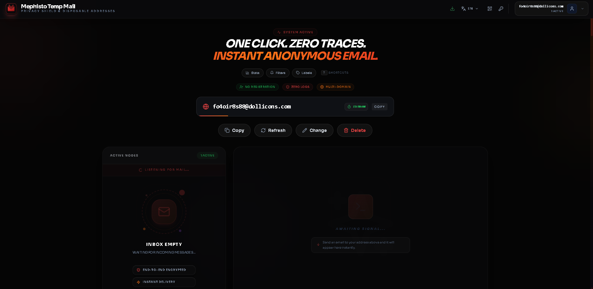
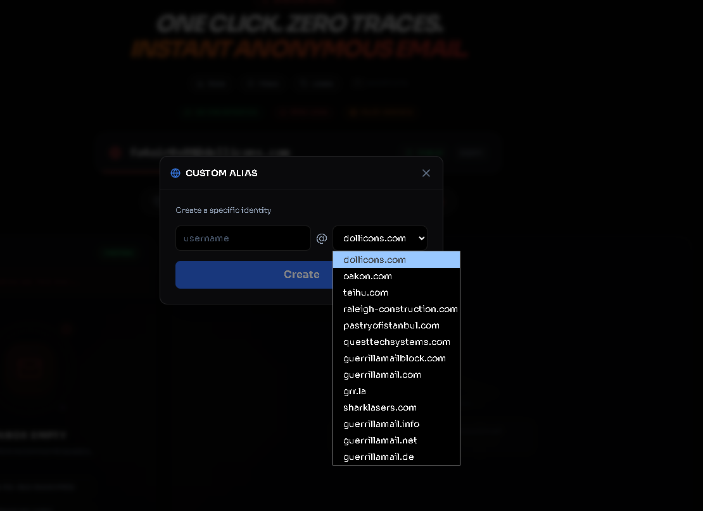
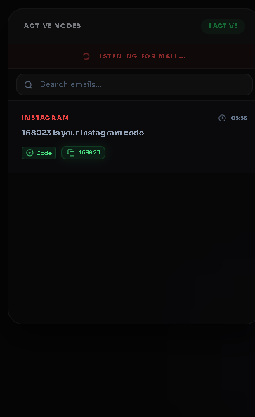
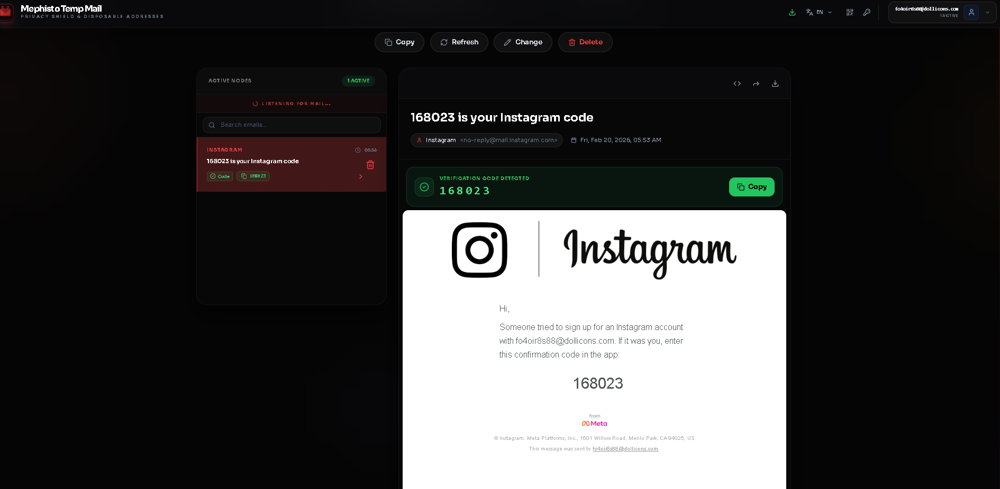

# 🛡️ MephistoMail — The Privacy-First Disposable Email Shield

    

> **"Identity is fluid. Privacy is absolute."**

MephistoMail is a cutting-edge, **RAM-only** disposable email service built for speed, anonymity, and zero-persistence. Designed to bypass trackers and protect your primary inbox from spam, it operates entirely in volatile memory, ensuring no logs are ever written to disk.

🌐 **Live Demo:** [mephistomail.site](https://mephistomail.site)

## 📸 Interface Gallery

### 1. The Dashboard — Zero Distractions
<p align="center">
  
</p>

### 2. Feature Walkthrough
<p align="center">
  
  
  
</p>
<p align="center">
  <em>From left to right: Create custom domain aliases, manage active sessions, and view rich HTML emails with instant 2FA code detection.</em>
</p>

## ✨ Key Features

- 🚀 **Instant Delivery:** Real-time WebSocket connection for sub-second email reception.
- 🧱 **Chrome Extension (Sideload):** An official, tracker-free Chrome extension to fetch and auto-copy OTPs seamlessly.
- 🧠 **RAM-Only Architecture:** Emails are stored in volatile memory and purged instantly upon session termination. **Zero logs.**
- 📱 **PWA Support:** Installable as a native-like app on iOS and Android. Works offline.
- 🔄 **Smart Domain Rotation:** Automatically cycles through available domains to bypass blocklists.
- 📲 **QR Code Handoff:** Instantly transfer your active session to mobile via QR code.
- 🔐 **Client-Side Encryption:** Passwords and keys are generated locally in your browser.
- 🌑 **Dark Mode UI:** Sleek, modern interface designed for focus and readability.
- 🌍 **Multi-Language:** Built-in support for English, Turkish, Spanish, German, and French.

## 🧩 Chrome Extension (Sideload Guide)

To strictly prevent any Google Web Store tracking or analytics, our extension operates standalone. 

1. Download the repository source code as a ZIP file.
2. Extract the archive and locate the `extension` folder.
3. Open your browser and navigate to `chrome://extensions`.
4. Enable **Developer Mode** (top-right corner).
5. Drag and drop the `extension` folder into the extensions page.

## 🛠️ Tech Stack & Architecture

Built with modern web technologies for performance and maintainability:

- **Frontend:** [React 18](https://react.dev/)
- **Language:** [TypeScript](https://www.typescriptlang.org/)
- **Build Tool:** [Vite](https://vitejs.dev/)
- **Styling:** [Tailwind CSS](https://tailwindcss.com/) + [Lucide Icons](https://lucide.dev/)
- **State Management:** React Hooks
- **Email API (Upstream):** [mail.tm](https://mail.tm/) / [mail.gw](https://mail.gw/)

## 🔍 Backend Transparency

> **"If the frontend is open source but the backend isn't, how do we trust it?"** — Great question. Here's the full picture.

**Architecture:**

```
[Browser] ←→ [WebSocket Proxy (Go)] ←→ [mail.tm / mail.gw APIs]
   ↑                  ↑
   RAM-only          Zero logs, no DB
   state             stateless relay
```

- **Frontend (this repo):** Fully open source. All email state lives in your browser's RAM. Close the tab → everything is gone. No localStorage, no IndexedDB, no cookies for email data.
- **Backend proxy (Go):** A thin, stateless WebSocket relay that connects your browser to upstream email providers (mail.tm, mail.gw). It does **not** store, log, or inspect any email content.

**Why is the backend private?**
The Go backend is currently being refactored for a clean public release. It contains rate-limiting logic, provider failover, and abuse prevention that we want to document properly before publishing. We expect to open-source it soon.

**What you can verify right now:**
1. Open DevTools → Network tab. Every API call goes to `api.mail.tm` or `api.mail.gw` — standard, well-known disposable email APIs.
2. The frontend stores zero persistent data. Inspect `localStorage` and `sessionStorage` — you'll find only UI preferences (language, theme), never email content.
3. The complete frontend source is here for audit.

## 🚀 Getting Started

Follow these steps to run MephistoMail locally on your machine.

### Prerequisites

- Node.js (v18 or higher)
- npm or yarn

### Installation

1.  **Clone the repository:**
    ```bash
    git clone https://github.com/jokallame350-lang/temp-mailmephisto.git
    cd temp-mailmephisto
    ```

2.  **Install dependencies:**
    ```bash
    npm install
    # or
    yarn install
    ```

3.  **Start the development server:**
    ```bash
    npm run dev
    # or
    yarn dev
    ```

4.  **Open your browser:**
    Navigate to `http://localhost:5173` (or the port shown in your terminal).

## 📦 Building for Production

To create an optimized production build:

```bash
npm run build
```

The output will be in the `dist/` directory, ready to be deployed to Vercel, Netlify, or any static host.

## 🤝 Contributing

Contributions are welcome! If you have ideas for improvements or bug fixes:

1.  Fork the repository.
2.  Create a feature branch (`git checkout -b feature/amazing-feature`).
3.  Commit your changes (`git commit -m 'Add amazing feature'`).
4.  Push to the branch (`git push origin feature/amazing-feature`).
5.  Open a Pull Request.

## 📄 License

This project is licensed under the **MIT License** - see the [LICENSE](LICENSE) file for details.

## 👤 Author

**Crow | Indie Developer**

- 𝕏 (Twitter): [@benmxrt](https://x.com/benmxrt)
- 🌐 Website: [mephistomail.site](https://mephistomail.site)

---

*Enjoying MephistoMail? Give it a ⭐️ star on GitHub!*

